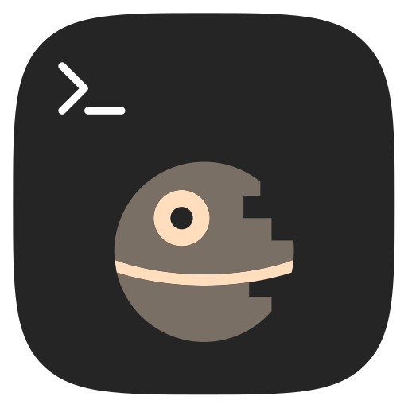

# ascii-movie



[](https://github.com/gabe565/ascii-movie/actions/workflows/build.yml)
[](https://artifacthub.io/packages/helm/gabe565/ascii-movie)

The original Star Wars telnet server is currently down, so why not implement it in Go? This server will open a TCP server on `0.0.0.0:23` and an SSH server on `0.0.0.0:22` which stream the original Star Wars ASCII movie to command line clients.

See it in action:
- **SSH:** Run `ssh gabecook.com`
- **Telnet:** Run `telnet gabecook.com`

## Demo
<div align="center">
  <video src="https://user-images.githubusercontent.com/7717888/233742309-4eeace5e-9a7c-41c6-9fc5-21ea19728f77.mp4"></video>
</div>

<details>
  <summary>Also available on asciinema</summary>

  <p align="center">
    <a href="https://asciinema.org/a/431278"></a>
  </p>
</details>

## Usage

The app can play a movie directly on your terminal with the [`play`](docs/ascii-movie_play.md) subcommand, or it can host an SSH and Telnet stream server with the [`serve`](docs/ascii-movie_serve.md) subcommand.

See generated [docs](./docs/ascii-movie.md) for command line usage information.

### Docker (Suggested)
An image is available at [`ghcr.io/gabe565/ascii-movie`](https://ghcr.io/gabe565/ascii-movie).

#### Watch Locally
The following command will run a container that plays the movie directly in your terminal.

```shell
docker run --rm -it -e ghcr.io/gabe565/ascii-movie play
```

#### Serve Movie over Telnet and SSH
The following command will run a Telnet server on port `23` and an SSH server on port `2222`.
```shell
docker run --rm -it -p 23:23 -p 2222:22 ghcr.io/gabe565/ascii-movie serve
```

### Kubernetes
A Helm chart is available for Kubernetes deployments.
See [charts.gabe565.com](https://charts.gabe565.com/charts/ascii-movie/) or
[gabe565/charts](https://github.com/gabe565/charts/tree/main/charts/ascii-movie) for details.

### Local Build
```shell
# Compile the app
go install github.com/gabe565/ascii-movie@latest

# Run the app in your terminal
ascii-movie play

# Or run it as a server
ascii-movie serve

# Now, run `ssh localhost` or `telnet localhost` to watch the movie!
```
